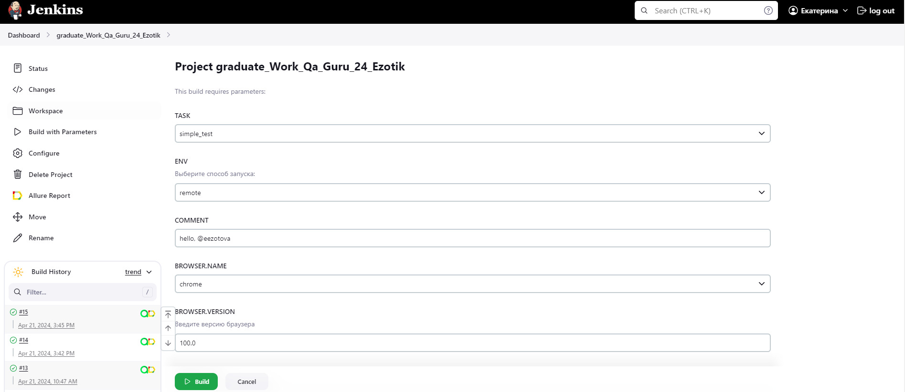

# Проект по тестированию тестового сайта [интернет магазина Skillbox](https://intershop4.skillbox.ru/)
<p align="center">

</p>

## :scroll: Содержание

- [Используемый стек](#computer-используемый-стек)
- [Покрытый функционал](#male_detective-покрытый-функционал)
- [Запуск автотестов](#arrow_forward-запуск-автотестов)
- [Сборка в Jenkins](#-сборка-в-jenkins)
- [Пример Allure-отчёта](#-пример-allure-отчёта)
- [Интеграция с Allure TestOps](#-интеграция-с-allure-testOps)
- [Интеграция с Jira](#-интеграция-с-jira)
- [Уведомления в Telegram с использованием бота](#-уведомления-в-telegram-с-использованием-бота)
- [Видео запуска тестов в Selenoid](#-видео-запуска-тестов-в-selenoid)

## :computer: Используемый стек

<p align="center">


</p>

- [x] Автотесты написаны на языке `Java`;
- [x] В качестве системы контроля версий используется `Git`;
- [x] Для тестирования использованы фреймворки `JUnit 5` и `Selenide`;
- [x] Инструментом для сборки Java-проекта является `Gradle`;
- [x] Управление удаленным браузером осуществляется с помощью `Selenoid`;
- [x] Для непрерывного выполнения тестовых сценариев используется `Jenkins`;
- [x] По результатам прогона автотестов, с помощью `Allure Report` генерируется отчет, оповещение с результатами тестов и ссылкой на отчет направляется в `Telegram-бот`;
- [x] Для управления тестированием, отслеживания результатов и анализа данных используется `Allure TestOps`;
- [x] Для управления проектом выполнена интеграция `Jira`.  

## :male_detective: Покрытый функционал

- [x] МОЙ АККАУНТ. Страница регистрации новых пользователей;
- [x] МОЙ АККАУНТ. Страница авторизации;
- [x] ГЛАВНАЯ. Поиск необходимых товаров;
- [x] КАТАЛОГ. Добавление товаров в корзину;
- [x] КОРЗИНА. Уменьшение количества товара в корзине;
- [x] КОРЗИНА. Применение неверного купона на скидку;
- [x] ОФОРМЛЕНИЕ ЗАКАЗА. Оформление заказ.

## :arrow_forward: Запуск автотестов

### Запуск тестов из терминала (с параметрами по умолчанию)
```
gradle clean simple_test
```
### Запуск тестов на удаленном браузере
```
gradle clean test -Denv=master
```
При необходимости также можно переопределить параметры запуска

```
clean
${TASK}
-Denv=${ENV}
-DbrowserName=${BROWSER.NAME}
-DbrowserVersion=${BROWSER.VERSION}
-DbrowserSize=${BROWSER.SIZE}
```

### Параметры сборки

* <code>TASK</code> – наименование задачи для запуска автотестов. По-умолчанию - <code>simple_test</code>.
* <code>ENV</code> – загружает конфигурационный файл удалённого запуска, активирующий дополнительные настройки автотестов, которые не используются при локальном запуске.
* <code>BROWSER.NAME</code> – браузер, в котором будут выполняться тесты. По-умолчанию - <code>chrome</code>.
* <code>BROWSER.VERSION</code> – версия браузера, в которой будут выполняться тесты. По-умолчанию - <code>100.0</code>.
* <code>BROWSER.SIZE</code> – размер окна браузера, в котором будут выполняться тесты.

##  [Сборка](https://jenkins.autotests.cloud/job/C24-MolokoVelosiped-ibs-ui-tests/) в Jenkins

Для запуска сборки необходимо перейти в раздел <code>Build with parameters</code> и нажать кнопку <code>Build</code>.
<p align="center">

</p>
После выполнения сборки, в блоке <code>Build History</code> напротив номера сборки появятся значки <code>Allure Report</code> и <code>Allure TestOps</code>, при клике на которые откроется страница с html-отчетом и тестовой документацией.

##  [Пример](https://jenkins.autotests.cloud/job/C24-MolokoVelosiped-ibs-ui-tests/allure/) Allure-отчёта


